# Fourier-transform-on-images-in-matlab

> In [mathematics](https://en.wikipedia.org/wiki/Mathematics), a **Fourier transform** (**FT**) is a [mathematical transform](https://en.wikipedia.org/wiki/Integral_transform) that decomposes [functions](https://en.wikipedia.org/wiki/Function_(mathematics)) depending on space or time into functions depending on spatial or temporal frequency, such as the expression of a musical [chord](https://en.wikipedia.org/wiki/Chord_(music)) in terms of the volumes and frequencies of its constituent notes. The term *Fourier transform* refers to both the [frequency domain](https://en.wikipedia.org/wiki/Frequency_domain) representation and the [mathematical operation](https://en.wikipedia.org/wiki/Operation_(mathematics)) that associates the frequency domain representation to a function of space or time. [Wikipedia]

 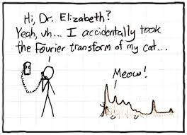
  

## Experimentations:

1. Compute and show the Fourier transform of a given image "pout.tif" and its magnitude and phase. Also, display the reconstructed images from magnitude and phase.

2. Take two images a cameraman.tif (A) and one of his picture pout.tif (B), then compute the magnitude and phase of Fourier transform of both images A and B, but reconstruct the images using (a) magnitude of A and phase of B, (b) magnitude of B and phase of A.

3. Take an image (e.g., pout.tif), compute the Fourier transform, and reconstruct the images after removing the low-frequency and high-frequency values.

<table>
  <tr>
    <td> 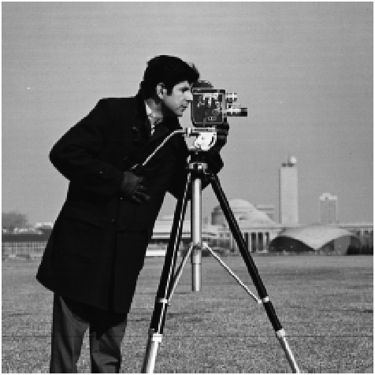 </td>
    <td> 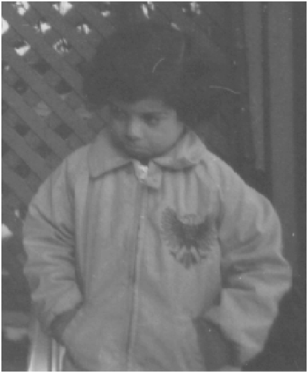 </td>
  </tr>
  <tr>
    <td>cameraman.tif</td>
    <td>pout.tif</td>
  </tr>
</table>

## Experiment 1:

Compute and show the Fourier transform of a given image "pout.tif" and its magnitude and phase. Also, display the reconstructed images from magnitude and phase.

### Results:

<table>
  <tr>
    <td>  </td>
    <td> 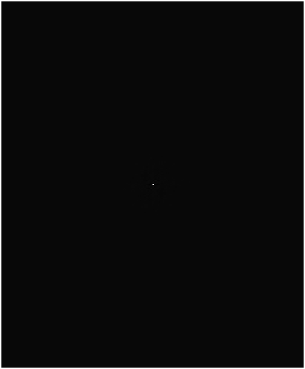 </td>
    <td> 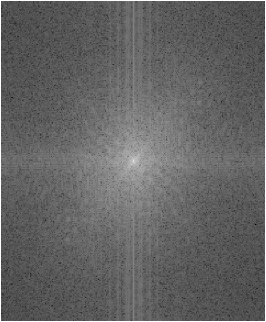 </td>
    <td>  </td>
  </tr>
  <tr>
    <td>Take FFT (what? there is just nothing left!)</td>
    <td>Shift the FFT (oh, there is a small white dot!)</td>
    <td>Scale it up (It’s actually a star!)</td>
    <td>Take inverse FFT (Bring the girl back!)</td>
  </tr>
</table>

That girl is a star in a different domain!

## Experiment 2:

Take two images a cameraman.tif (A) and other image pout.tif (B), then compute the magnitude and phase of Fourier transform of both images A and B, but reconstruct the images using (a) magnitude of A and phase of B, (b) magnitude of B and phase of A.

### Results:

<table>
  <tr>
    <td>  </td>
    <td> 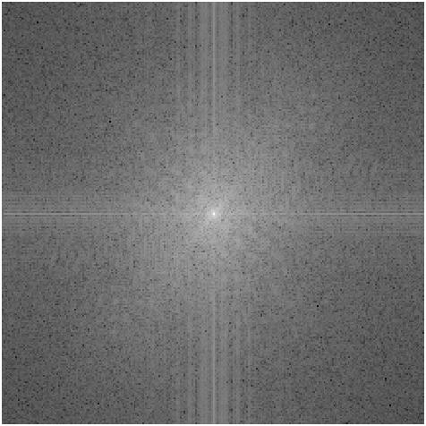 </td>
    <td> 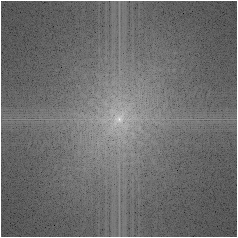 </td>
    <td> 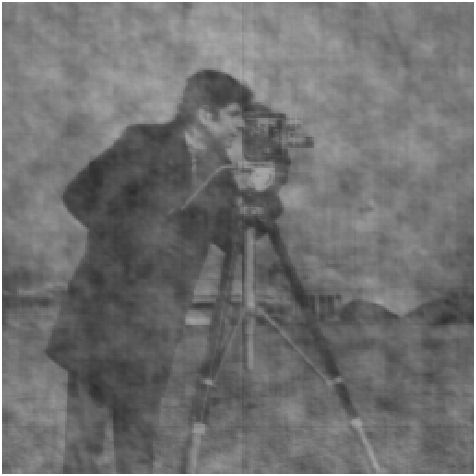 </td>
  </tr>
  <tr>
    <td>pout.tif (A)</td>
    <td>FFT (A)</td>
    <td>FFT (magnitude of A, phase of B)</td>
    <td>image (magnitude of A, phase of B)</td>
  </tr>
  <tr>
    <td>  </td>
    <td> 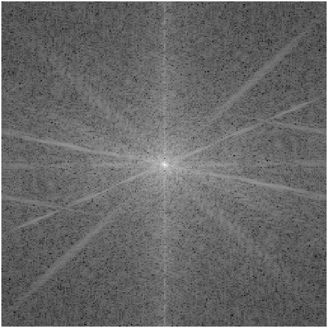 </td>
    <td> 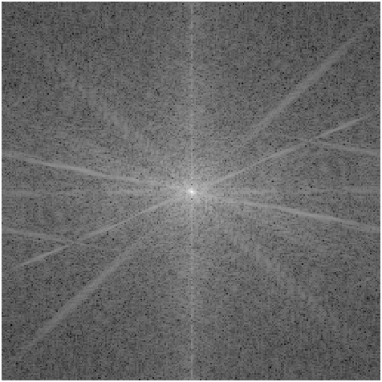 </td>
    <td> 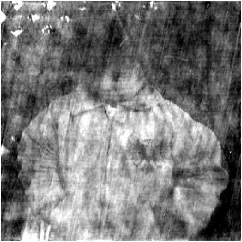 </td>
  </tr>
  <tr>
    <td>cameraman.tif (B)</td>
    <td>FFT (B)</td>
    <td>FFT (magnitude of B, phase of A)</td>
    <td>image (magnitude of B, phase of A)</td>
  </tr>
</table>

## Experiment 3:

Take an image (e.g., pout.tif), compute the Fourier transform, and reconstruct the images after removing the low-frequency and high-frequency values.

### Results:

<table>
  <tr>
    <td> 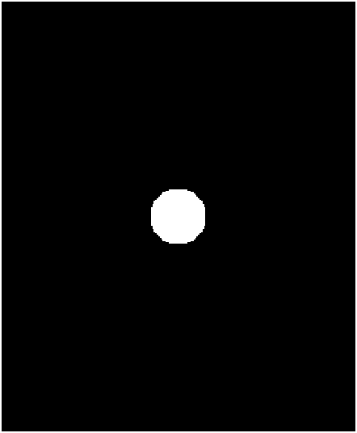 </td>
    <td> 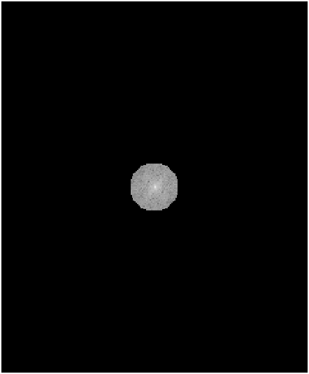 </td>
    <td> 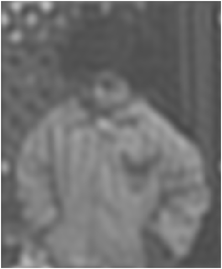 </td>
  </tr>
  <tr>
    <td>Filter 1</td>
    <td>FFT after applying Filter 1</td>
    <td>Image (removing high frequencies)</td>
  </tr>
  <tr>
    <td> 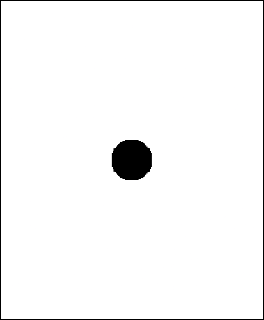 </td>
    <td> 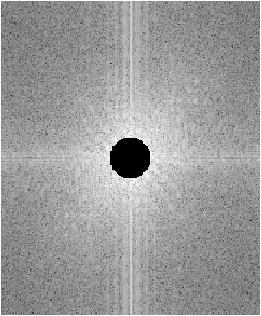 </td>
    <td> 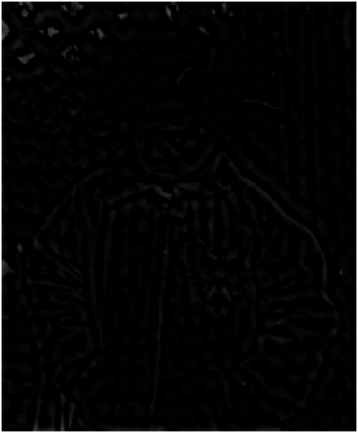 </td>
  </tr>
  <tr>
    <td>Filter 2</td>
    <td>FFT after applying Filter 2</td>
    <td>Image (removing low frequencies)</td>
  </tr>
</table>

